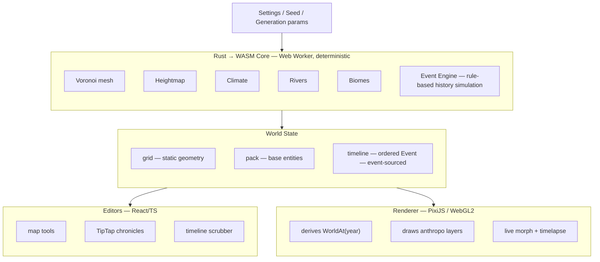
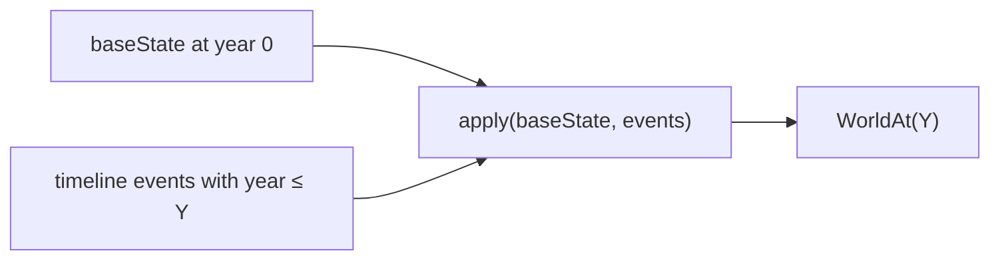
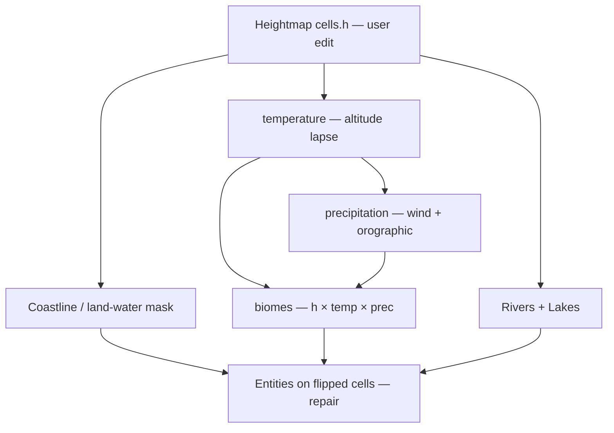

# Worldgen (codename: Worldforge) — Design Doc

> Design overview for the local-first, FMG-style worldbuilding map
> generator. This document captures the **what and why** (vision, scope,
> architecture, data model, key contracts).

---

## 1. Why this tool exists

Worldgen is an FMG-style (Azgaar's Fantasy Map Generator) procedural map
generator **geared to worldbuilding**, 100% local, smooth at **≤60k cells /
60fps**, with a **time-varying world** and **procedurally generated history**.

---

## 2. Scope locks

| Fact | Value |
| --- | --- |
| Cell cap (MVP) | **60,000** |
| Idle / scrub FPS | **60** |
| 100% local | No server. "Backend" = Rust→WASM worker (+ optional Tauri native process). |
| Static layers (gen once) | terrain, biome, climate, heightmap |
| Time-varying layers | states, provinces, cultures, religions, burgs, armies, populations |
| Renderer | PixiJS v8 (WebGL2) |
| Determinism | Same seed → byte-identical world + timeline |
| LLM | Opt-in, user-supplied api key |
| Rich text | TipTap + `tiptap-markdown` |

**Explicitly out of scope (MVP):** 3D extruded terrain; routes/markets/military-economy trade sim; multi-user/server/cloud; maps >60k cells.

---

## 3. Tech stack

| Layer | Technology |
| --- | --- |
| Compute / simulation core | **Rust → WASM** (`wasm-pack`, `wasm-bindgen`), `spade` for Delaunay/Voronoi |
| Renderer | **PixiJS v8** (WebGL2) + **React** wrapper |
| UI framework | **React + TypeScript** |
| State | **Zustand** store |
| Rich-text history | **TipTap + `tiptap-markdown`** |
| Persistence | **IndexedDB + OPFS**; world saved as single `.world` (ZIP archive) |
| Optional LLM | Client-side `fetch` to user endpoint (OpenAI / Anthropic / Ollama / llamma.cpp) |
| Build / tooling | **Vite** + `vite-plugin-wasm` + Biome |

---

## 4. Architecture

Four-layer separation, FMG-2.0-inspired but event-sourced. **Dependency rule:
generators/editors never touch the canvas; renderer never mutates state; state
has no rendering code, the year is a pure read of state
(`WorldAt(year)`).



---

## 5. Data model (the core change from FMG)

FMG stores `pack.burgs`, `pack.states` as **present-time truth**. Worldgen adds
a **timeline** and makes entities **event-addressable**.

### 5.1 Static geometry (`grid`) — generated once; heightmap user-editable
Voronoi cells, `cells.h` (height 0–100, <20 = water), `cells.temp`,
`cells.prec`, `cells.biome`, neighbors, vertices. The mesh is static, but
**`cells.h` is user-editable** — edits propagate to its dependents. The mesh
itself **never time-varies** with the year scrubber.

### 5.2 Base entities (`pack`) — present-time truth at the "year 0" anchor
`State`, `Province`, `Burg`, `Culture`, `Religion`, `Army`, each with base
attributes + a `foundedYear` / `dissolvedYear` span.

### 5.3 Timeline (`Event[]`) — the engine's output
```rust
struct Event {
  id: u64,
  year: i32,                 // in-universe year (can be negative)
  entity_id: u32,
  entity_type: EntityType,   // State | Province | Burg | Army | Religion | Culture | Pop
  kind: EventKind,           // Succession | War | Plague | GoldenAge | Schism | Found | Conquer | Migrate | Treaty ...
  payload: EventPayload,     // structured, type-specific (fixed-shape serde enum)
  narrative: Option<String>, // optional LLM-polished prose (Markdown)
}
```

### 5.4 Deriving the world at year Y (no re-simulation)

- **Borders:** states own cell-sets; `Conquer`/`Secession`/`Found` add/remove cells.
- **Armies:** `Raise`/`March`/`Battle`/`Disband` move/resize unit markers.
- **Religions:** `Schism` spawns a new `Religion` entity with a seeded follower fraction.
- **Populations:** `Plague`/`GoldenAge`/`Migration` scale burg/state population.
- **Cities:** `Found`/`Raze`/`Growth` toggle & resize burgs.

This projection is **O(events ≤ Y)** and cheap → 60fps scrubbing. The last
derived `WorldAt(Y)` is cached; incremental scrubs apply only the delta. For
seeks backward, **checkpoints every 250 years** keep any seek near O(250), not
O(Y). Memory is bounded (~11MB at 60k cells × 3000yr).

---

## 6. The two orthogonal axes

This is the central design decision. Two independent axes never interact:

1. **Authoring axis** — the user sculpts the heightmap; rivers, lakes,
   coastline, temperature, precipitation, biomes, and entities on flipped cells
   **recompute from it**. This changes the **year-0 baseline** (`grid.cells.h`).
2. **Timeline axis** — the year scrubber animates only the **anthropological
   layer** (states, provinces, cities, armies, religions, cultures, borders,
   populations). Heightmap edits are authoring-time and do not interact with the
   year scrubber.

**Dependency graph (authoring — edits flow downstream):**


**Two-tier recompute**:
- **Tier 1 (live, on pointermove):** recompute `temp` + `biome` for affected
  cells only — gives live visual feedback as land is raised/lowered (<16ms).
- **Tier 2 (debounced ~200ms on stroke-end):** full global pass in the worker —
  rivers (`resolveDepressions` + downhill flow), lakes, coastline mask,
  precipitation, biomes, then the **entity repair cascade** (<300ms @ 60k).

**Entity repair cascade** (land↔water flip during Tier 2):
- *Land → Water:* any `Burg` on such a cell is **removed** (warning toast lists
  affected burgs); `cells.state`/`cells.province` for water cells are
  **unassigned**; a state that loses all its cells is marked `dissolved`.
- *Water → Land:* no automatic action.

**Editing tools:** brush **raise / lower / flatten / smooth** (radial falloff +
strength) plus macro tools **Range, Trough, Strait, Mask, Invert, Add,
Multiply**, and a **reset-to-generated** (restores the seeded baseline). The
**edited `cells.h` becomes canonical** — exactly what serializes to `.world`.
"Same seed → same world" holds for the unedited baseline; edits are explicit
authoring overrides.

---

## 7. Event engine (deterministic, seeded, rule-based)

Rust module `event_engine`. Same seed → same history. Run once on user request,
stored in `timeline`, **regenerable** with a new seed/params.

| Module | Emits | Example |
| --- | --- | --- |
| `succession` | `Succession` | Ruler dies → heir inherits **or** `CivilWar` if disputed. |
| `war` | `War` (+ `Battle`, `Conquer`, `Treaty`) | State A vs B; outcome by army size, pop, terrain, RAND. |
| `plague` | `Plague` | Pop crash + slow recovery; may trigger `Migration`. |
| `golden_age` | `GoldenAge` | Growth buff to pop/economy. |
| `schism` | `Schism` | Religion splits → new `Religion` (denomination) entity. |
| `found_expand` | `Found`/`Conquer`/`Secession` | Drives border evolution over time. |
| `migration` | `Migrate` | Culture/religion spread across cells. |

Each module is seeded and parameterized (intensity sliders, era start/end, event
probability). Modules run in chronological order, reading the evolving
`WorldAt(year)` so later events react to earlier ones.

**Optional LLM polish:** after structured events exist, "Polish with LLM" turns
selected events' `payload` into `narrative` Markdown via client `fetch` to the
user's provider. Stored back on the event. **Fully optional; offline tool is
complete without it.**

---

## 8. Rendering (PixiJS)

> **Core technique (beats FMG's SVG cliff):** One **merged mesh** per
> time-varying layer. All cell polygons concatenated into a single vertex
> buffer. Each vertex carries `(x, y, aCellId)`. A **1×N RGBA data texture**
> (`colorTex`) maps `cellId → color`. The fragment shader does
> `color = texture(colorTex, vec2((aCellId+0.5)/N, 0.5)).rgb`. **Recoloring on
> year/selection change = update `colorTex` only**.

**Layer draw order (back→front):** terrain → biome → cultures → religions →
states fill → borders (derived polylines where adjacent cells differ in `state`)
→ provinces → burgs (instanced point sprites) → armies → selection highlight.

**Budget:** ≤ ~10 draw calls for the whole map at 60k cells (vs FMG's 60k SVG
nodes). **Culling:** Pixi viewport culling on the camera container.

**Year scrub** updates only the data textures + transforms of army/burg markers;
static geometry untouched → cheap 60fps. **Timelapse export:** step the year
N→M, render each frame to an offscreen canvas, encode to **WebM/MP4**
(MediaRecorder), streamed with bounded memory.

---

## 9. The Determinism Contract


1. **One RNG, one seed.** `StdRng::seed_from_u64(seed)`. 
2. **Float determinism.** All generation math in `f64`. Never branch on `f32`.
3. **No HashMap iteration in order-sensitive code.** Use `BTreeMap` or sorted `Vec`.
4. **Total-order comparators.** Every `.sort()` uses a total-order comparator.
5. **Quantize at the boundary.** Store results as integers → trivially reproducible.
6. **Event IDs & ordering.** Events sorted by `(year, id)`; `id` from a seeded
   monotonic counter.
7. **JS must not feed randomness back.** Worker receives only `seed` + `opts`.

**Verification (CI gate):** `generate_world(seed, 60000)` twice → **xxHash64** of
serialized bytes equal; cross-browser (Chromium + Firefox) equality. Same
`(pack, timeline, year)` → byte-equal `WorldAt`.

> **Build gotchas:**
> - `getrandom` needs `features = ["js"]` for wasm builds.
> - Don't reintroduce RNG into `core/` (e.g. a fixed `15.0` replaced FMG's
>   `rand(10,20)` in the coastal-precip branch).
> - Biomes moisture omits the river-flux bonus until `rivers.rs` is wired in.

---

## 10. Persistence: `.world` format

`.world` = a **ZIP** (browser `fflate`), versioned:
```
worldforge.world/
├── meta.json          # version, seed, cellCount, worldW/H, eraStart/End, appVersion
├── grid.bin           # CSR-packed typed arrays + header
├── pack.json          # entities (small; JSON is fine)
├── timeline.bin       # COLUMNAR typed arrays: year, entity_id, entity_type, kind, narrative_present
├── timeline_payloads.json  # { eventId: EventPayload } — variable-shape sidecar
└── chronicles.json    # { entityId: TipTapJSON }
```
**Why columnar + sidecar:** events can exceed 10⁵; fixed fields in tight typed
arrays, payloads as JSON. ~5–10× smaller than full JSON. **Reload invariance:**
`load()` yields byte-identical `grid`/`pack`/`timeline`. **Versioning:**
`meta.version` migrations; refuse newer formats rather than silently corrupt.
Other exports: **GeoJSON** (cell polygons), **Markdown** (any chronicle).

---

## 11. Performance budget

| Operation | Target |
| --- | --- |
| Generate 60k-cell world (WASM worker) | < 2s, non-blocking |
| Frame render at 60k cells, idle | 60fps |
| Scrub one year step (derive + recolor) | < 4ms (cached delta) |
| Timelapse export (3000yr @ 30fps) | streamed, bounded memory |
| `.world` load (60k) | < 1s |
| Heightmap edit recompute (debounced, 60k) | < 300ms (worker) |
| Live brush recolor (affected cells only) | < 16ms |

Regression gate: a vitest/Playwright perf test fails the build if any target is
exceeded by > 20%.

---

## 12. Milestones & current status

MVP = a functioning map with **states, religions, and cultures**, each with
**procedurally generated history** (succession chains; schisms spawning
denominations).

| Phase | Scope | State |
| --- | --- | --- |
| P0 | Scaffold + toolchain (`add(2,3)===5` via worker) | ✅ DONE |
| P1.1–P1.5 | Voronoi mesh, heightmap, climate, biomes, `generate_world` pipeline (<2s @ 60k, deterministic) | ✅ DONE |
| P2.1–P2.3 | Worker bridge, PixiJS canvas mount, terrain+biome render (60fps pan/zoom) | ✅ DONE |
| P2.5.1–P2.5.3 | Brush + macro edit, live Tier-1 recolor, full Tier-2 dependent recompute | ✅ DONE |
| **P2.5.4** | **Entity repair cascade + heightmap editor UI (`Reset`)** | ⏳ NEXT |
| P2.5.5 | Cell pick + per-cell inspector/edit | ⏳ |
| P3 | Entities (states, provinces, cultures, religions) + render + click-select | ⏳ |
| P4 | Event engine + `WorldAt(year)` projector + timeline | ⏳ |
| P5 | Timeline scrubber + live morph + timelapse export | ⏳ |
| P6 | TipTap chronicles + schism/succession trees | ⏳ |
| P7 | Optional LLM polish | ⏳ |
| P8 | `.world` save/load (byte-identical) + GeoJSON/MD export | ⏳ |
| P9 | E2E MVP walkthrough + perf confirmation (`PERF.md`) | ⏳ |

Full step-by-step sequence with per-step verification gates:
`agent/worldforge-implementation-plan.md`.

---

## 13. Source basis & references

- **FMG v1.139.12 source study** (why-this-exists + algorithms):
  `agent/azgaar-fmg-research.md`.
- **Architecture, data model, MVP scope** (the long-form version of §1–§8):
  `agent/worldbuilding-tool-design.md`.
- **Engineering contracts** (exact structs, worker protocol, determinism, byte
  layout, edge cases, tests, CI): `agent/worldgen-technical-requirements.md`.
- **Step sequence with gates** (what to build next, one step at a time):
  `agent/worldforge-implementation-plan.md`.
- **Build status index** (current head, what exists, gotchas): `agent/PROGRESS.md`.

> If anything here conflicts with the design doc, the design doc intent wins and
> this overview should be patched to match.
